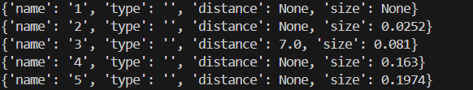
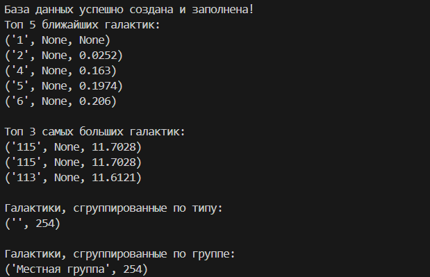
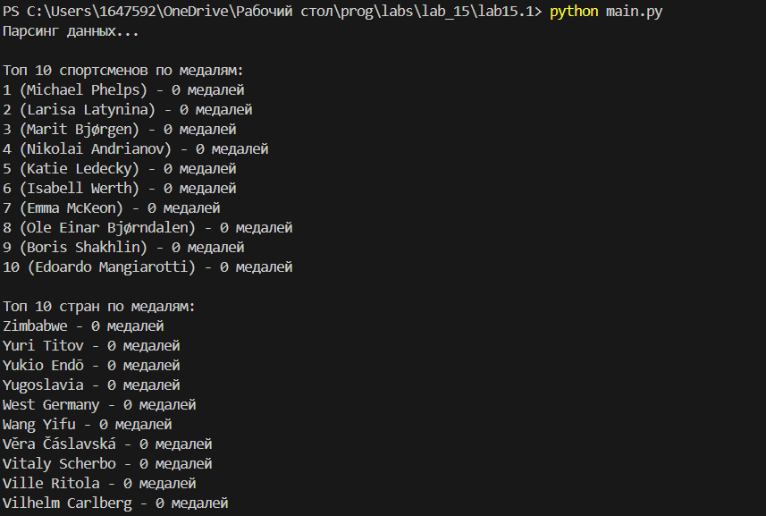
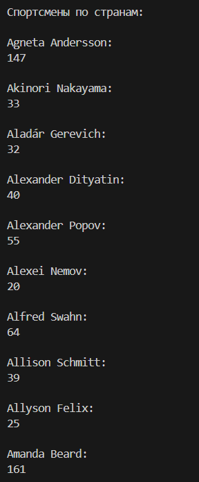

# Лабораторная работа №3
## Вариант 10 и Вариант 5
## Задание 
1. Спроектируйте БД с использованием crow’s foot notation.
2. Реализуйте парсер для сбора данных с веб-страницы.
3. С помощью DB API cоздайте таблицы БД и заполните их данными, полученными с помощью парсера.
4. Напишите запросы для выборки данных из БД.
```
Список самых высоких зданий и сооружений мира.

Таблицы:

здания
страны
типы зданий
Запросы:

топ N стран по числу высоких зданий
здания с группировкой по странам
здания с группировкой по типам
суммарная высота первых 50 зданий в км
```
## Код для парсинга
```
import requests
from bs4 import BeautifulSoup
import re

def parse_galaxies(url):
    response = requests.get(url)
    response.raise_for_status()

    soup = BeautifulSoup(response.content, 'html.parser')
    table = soup.find('table', {'class': 'wikitable'})

    galaxies = []
    if table:
        rows = table.find_all('tr')
        for row in rows[1:]:
            cells = row.find_all('td')
            if len(cells) >= 6:
                name = cells[0].text.strip()
                type_galaxy = cells[1].text.strip()
                distance_str = cells[3].text.strip().replace(',', '.').split(' ')[0]
                size_str = cells[4].text.strip().replace(',', '.').split(' ')[0]

                try:
                    distance_str = re.sub(r'[^\d.]', '', distance_str)
                    size_str = re.sub(r'[^\d.]', '', size_str)

                    if not distance_str or distance_str == '.' or distance_str == '..':
                        distance = None
                    else:
                        distance = float(distance_str)

                    if not size_str or size_str == '.' or size_str == '..':
                        size = None
                    else:
                        size = float(size_str)

                    galaxies.append({'name': name, 'type': type_galaxy, 'distance': distance, 'size': size})
                except ValueError:
                    print(f"Ошибка преобразования для галактики: {name}.  Данные: distance='{distance_str}', size='{size_str}'")
                    continue
    else:
        print("Таблица с данными о галактиках не найдена.")

    return galaxies

if __name__ == '__main__':
    url = "https://ru.wikipedia.org/wiki/Список_ближайших_галактик"
    galaxies_data = parse_galaxies(url)
    for galaxy in galaxies_data[:5]:
        print(galaxy)
```
## Критерии парсинга
```
import sqlite3
import parser

db_file = "galaxies.db"
conn = sqlite3.connect(db_file)
cursor = conn.cursor()

def create_tables(conn):
    cursor = conn.cursor()

    cursor.execute("""
        CREATE TABLE IF NOT EXISTS TIP (
            id_tipu INTEGER PRIMARY KEY AUTOINCREMENT,
            name VARCHAR(255),
            description TEXT
        )
    """)

    cursor.execute("""
        CREATE TABLE IF NOT EXISTS GRUPPA (
            id_gruppi INTEGER PRIMARY KEY AUTOINCREMENT,
            name VARCHAR(255),
            description TEXT
        )
    """)

    cursor.execute("""
        CREATE TABLE IF NOT EXISTS GALAKTIKA (
            id_galaktiki INTEGER PRIMARY KEY AUTOINCREMENT,
            name VARCHAR(255),
            type VARCHAR(255),
            id_gruppi INTEGER,
            distance REAL,
            size REAL,
            FOREIGN KEY (id_gruppi) REFERENCES GRUPPA(id_gruppi),
            FOREIGN KEY (type) REFERENCES TIP(name)
        )
    """)

    conn.commit()


def populate_database(conn, galaxies):
    """
    Заполняет таблицы данными о галактиках.
    """
    cursor = conn.cursor()

    tipi = set(g['type'] for g in galaxies)  
    for tip in tipi:
        cursor.execute("INSERT OR IGNORE INTO TIP (name) VALUES (?)", (tip,)) 

    cursor.execute("INSERT OR IGNORE INTO GRUPPA (name, description) VALUES (?, ?)", ('Местная группа', 'Группа галактик, включающая Млечный Путь'))
    id_gruppi = 1 

    for galaxy in galaxies:
        try:
            cursor.execute("""
                INSERT INTO GALAKTIKA (name, type, id_gruppi, distance, size)
                VALUES (?, ?, ?, ?, ?)
            """, (galaxy['name'], galaxy['type'], id_gruppi, galaxy['distance'], galaxy['size']))
        except sqlite3.IntegrityError as e:
            print(f"Ошибка при вставке галактики {galaxy['name']}: {e}")

    conn.commit()


def top_n_galaxies(conn, n, order_by, ascending=True):
    """Топ N галактик по заданному критерию."""
    cursor = conn.cursor()
    order = "ASC" if ascending else "DESC"
    query = f"""
        SELECT name, distance, size FROM GALAKTIKA
        ORDER BY {order_by} {order}
        LIMIT {n}
    """
    cursor.execute(query)
    return cursor.fetchall()

def galaxies_grouped_by_type(conn):
    """Галактики, сгруппированные по типу."""
    cursor = conn.cursor()
    query = """
        SELECT type, COUNT(*) FROM GALAKTIKA
        GROUP BY type
    """
    cursor.execute(query)
    return cursor.fetchall()

def galaxies_grouped_by_group(conn):
    """Галактики, сгруппированные по группе."""
    cursor = conn.cursor()
    query = """
        SELECT g.name, COUNT(*) FROM GALAKTIKA ga
        JOIN GRUPPA g ON ga.id_gruppi = g.id_gruppi
        GROUP BY g.name
    """
    cursor.execute(query)
    return cursor.fetchall()

galaxies_data = parser.parse_galaxies("https://ru.wikipedia.org/wiki/Список_ближайших_галактик")

create_tables(conn)

populate_database(conn, galaxies_data)

print("База данных успешно создана и заполнена!")

print("Топ 5 ближайших галактик:")
for row in top_n_galaxies(conn, 5, "distance"):
    print(row)

print("\nТоп 3 самых больших галактик:")
for row in top_n_galaxies(conn, 3, "size", ascending=False):
    print(row)

print("\nГалактики, сгруппированные по типу:")
for row in galaxies_grouped_by_type(conn):
    print(row)

print("\nГалактики, сгруппированные по группе:")
for row in galaxies_grouped_by_group(conn):
    print(row)

conn.close()
```
## Скриншоты
  

  

  

